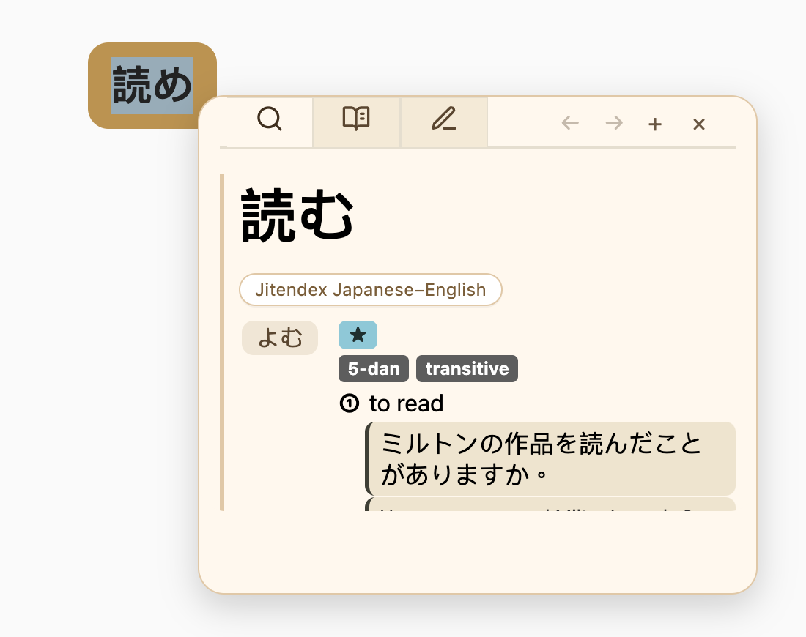
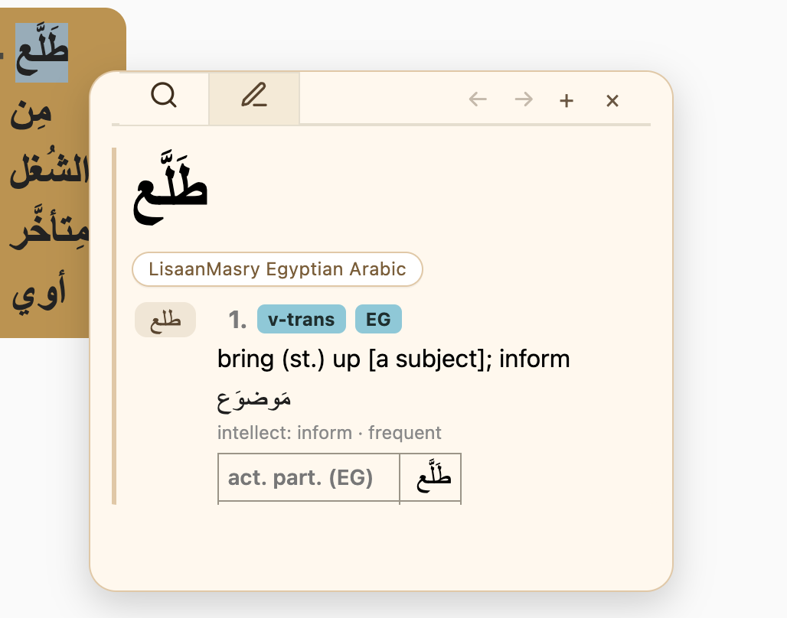
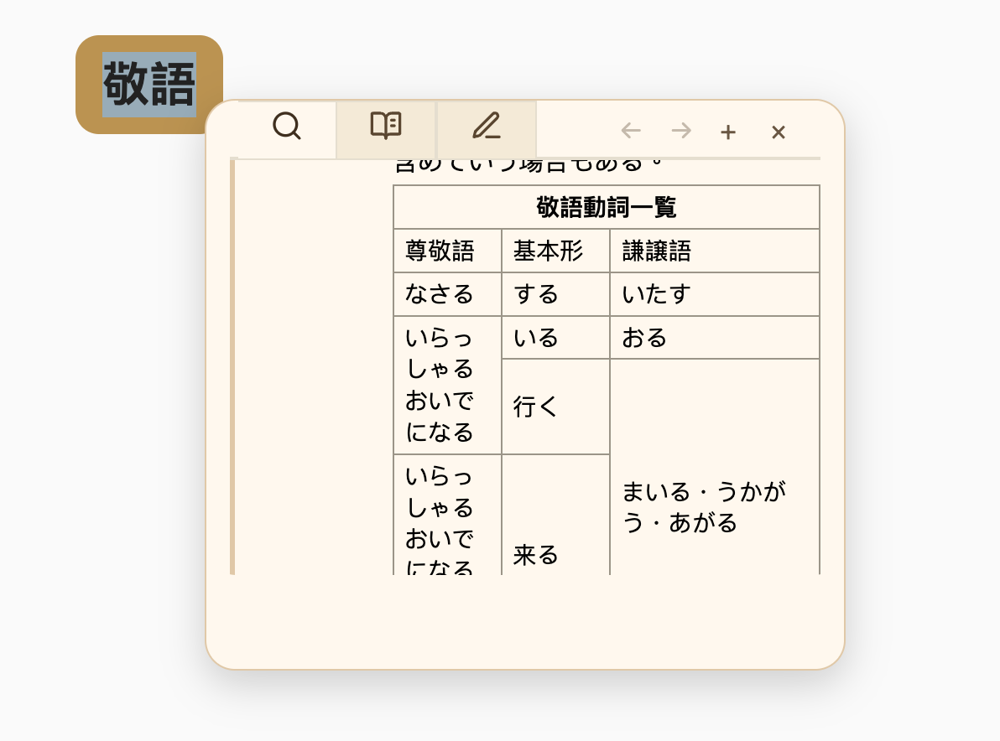
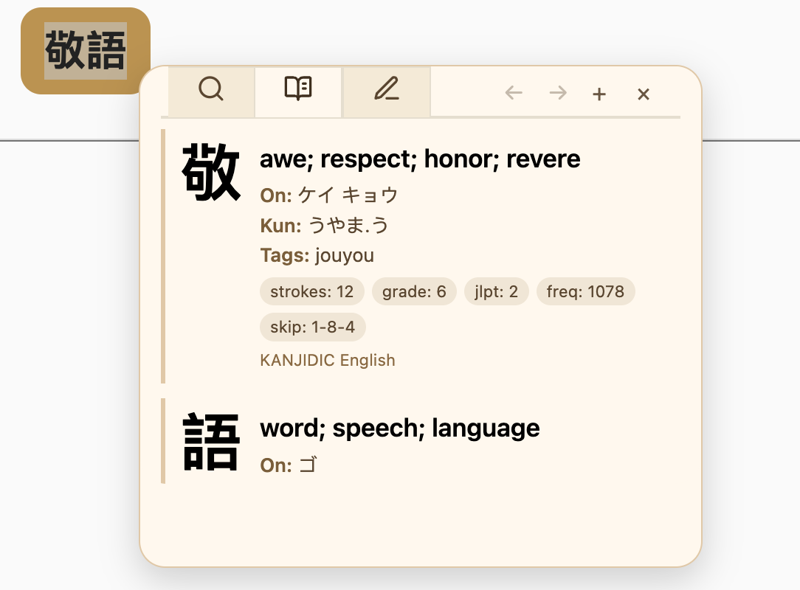
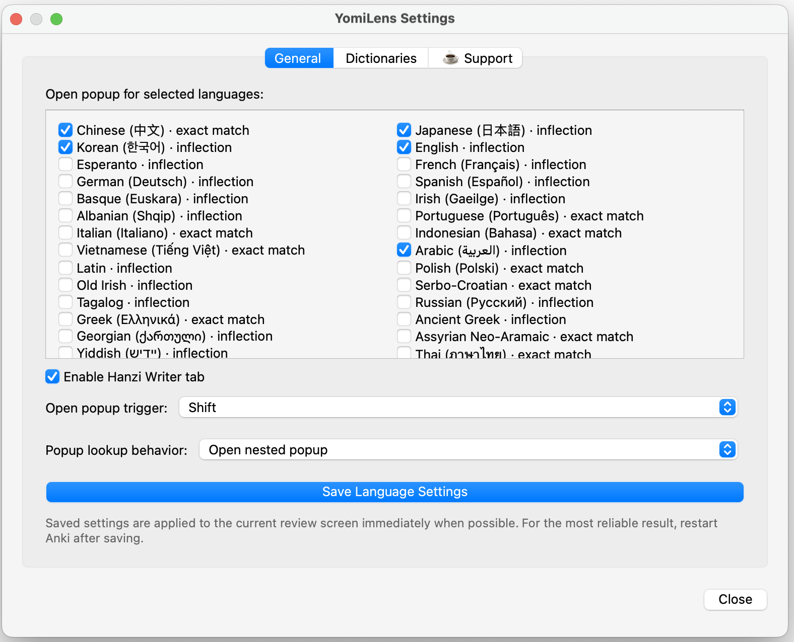
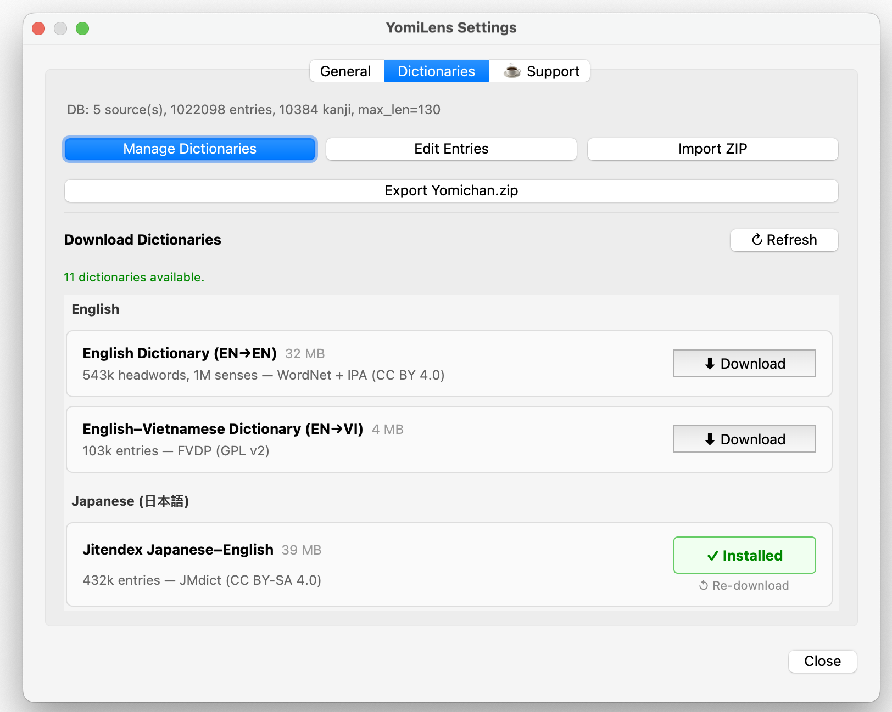

# YomiLens

**YomiLens** is a Yomitan/Yomichan-style popup dictionary for Anki.

Select a word on an Anki review card and YomiLens opens a clean floating dictionary popup directly inside the reviewer. It supports Yomitan/Yomichan dictionary ZIPs, multilingual lookup, inflection handling for many languages, kanji lookup, custom entries, and optional Hanzi Writer practice.

  

## Features

- Popup dictionary lookup inside Anki review cards
- Import Yomitan/Yomichan-compatible dictionary ZIP files
- Built-in dictionary downloader
- Multilingual popup language filters
- Inflection-aware lookup for languages such as Japanese, English, Korean, Arabic, German, French, Spanish, Russian, and more
- Exact-match lookup for languages and scripts where inflection rules are not available
- KANJIDIC-style kanji lookup tab
- Structured dictionary rendering, including tables and images from supported Yomitan dictionaries
- Nested popup lookup, or reuse-current-popup lookup, selectable in settings
- Optional modifier key trigger: No key, Opt, Ctrl, Shift, or Cmd
- Optional Hanzi Writer tab for character stroke practice
- Add and edit custom dictionary entries
- Back/forward popup navigation
- Dictionary management with delete/rebuild progress

## Screenshots

### Multilingual support

YomiLens supports lookup across many languages and scripts, including structured Yomitan entries with labels, forms, tables, and right-to-left text.

  

### Structured table rendering

YomiLens supports structured-content dictionaries, including table layouts.

  

### Kanji tab

When a KANJIDIC-style dictionary is installed, YomiLens can show readings, meanings, tags, stroke count, grade, JLPT level, frequency, and more.

  

### Settings

Choose which languages can open popups, configure the popup trigger key, and choose how lookup inside a popup behaves.

  

Download dictionaries directly from the settings window, or import your own Yomitan/Yomichan ZIP files.

  

## Basic Usage

1. Install the add-on in Anki.
2. Open **Tools → YomiLens Settings**.
3. Go to **Dictionaries** and download or import dictionaries.
4. Go to **General** and enable the languages you want.
5. During review, select text on a card to open the popup.

If you choose a modifier trigger, hold that key while selecting text, or select text first and then press the configured key.

## Dictionaries

YomiLens can import Yomitan/Yomichan dictionary ZIP files.

Optional downloadable dictionaries are maintained separately here:

https://github.com/MarshNg/yomilens-dictionaries

If an older imported dictionary looks broken after an update, remove it and import/download it again so YomiLens can rebuild the index with the latest parser.

## Installation

The public AnkiWeb page is here:

https://ankiweb.net/shared/info/1807906393

For development, this repository contains the add-on source files. The folder can be packaged as an Anki add-on ZIP, excluding local files such as `.git`, `__pycache__`, `.DS_Store`, `yomi_index.db`, and `yomi_config.json`.

## Credits

Special thanks to the Yomitan project and contributors for the dictionary format, language tooling, and inspiration:

https://github.com/yomidevs/yomitan

Dictionary data credits include EDRDG, Jitendex, CC-CEDICT, LingLook / Phong Phan, Open English WordNet, Free Vietnamese Dictionary Project, LisaanMasry, and other open dictionary contributors.
